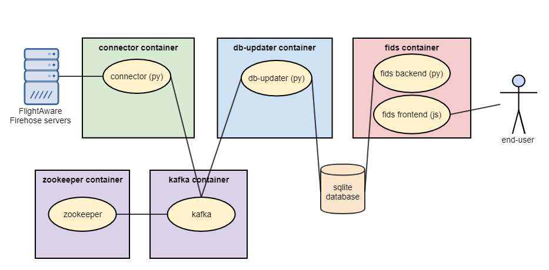

# Firestarter - Getting started with FlightAware Firehose
Firestarter is a small collection of services and sample applications to help
you get started using [FlightAware's Firehose Flight Data Feed](https://flightaware.com/commercial/firehose/documentation).

Firestarter is structured as a group of Docker containers managed by
Docker Compose. Currently, 2 core services and 1 sample application are
included, with more being developed (see [the roadmap](./ROADMAP.md) for
details).

## Quickstart
You must set the following variables (in your environment or a .env file)
before you can start using Firestarter.
* FH_USERNAME - Your FlightAware Firehose account username
* FH_APIKEY - The key to your FlightAware Firehose account
* INIT_CMD_ARGS - Firehose initiation command; more information about this is
available at https://flightaware.com/commercial/firehose/documentation/commands
and in the env section of [docker-compose.yml](./docker-compose.yml). Its value
will vary based on your account configuration, but a very basic example that
should work for most users is `events "flightplan departure arrival
cancellation"`.

There are a number of other environment variables that can be set to tune the
behavior of Firestarter. They are documented in
[docker-compose.yml](./docker-compose.yml).

You'll also need to install Docker (18.06+) and Docker Compose (1.22.0+)\
Details available at Docker's site: https://docs.docker.com/get-docker/

The usual Docker Compose incantation run in the root of this repo will get you
up and running:
```
docker-compose up --build
```

After running the above command and letting the 3 containers build, you should
be greeted with log output from each container. The services will log
periodically as Firehose messages are received, while the sample webapp will
produce some initial log output and then only log as requests are made to it.

You can test out the sample application by visiting http://localhost:5000 in
your web browser (if not running Docker locally, use the Docker host's
address).


## Firestarter Components



### connector
The connector service handles connecting to Firehose over an SSL socket. This
involves building and sending the initiation command, handling compression, and
reconnecting to Firehose without data loss if the connection is interrupted.
The connector then forwards Firehose messages to its own clients.

### db-updater
The db-updater service receives Firehose messages from the connector and
maintains a database table based on their contents. The service is capable of
handling so-called "flifo" (flight info) messages and airborne position messages.
Two db-updater containers are configured by default - one handles flight info and
updates a "flights" table, and the other handles airborne positions and updates
a "positions" table. The flight info db-updater uses sqlite by default (but has been
tested with PostgreSQL), and the position db-updater uses TimescaleDB which is
based on PostgreSQL. Other databases could potentially be supported with little
effort. To prevent bloat, flights and positions older than 48 hours are
automatically dropped from the table.

### fids
The sample application is a webapp backed by the flights database. You can use
it to browse flight data by airport, presenting flights similarly to how you'd
see them on a flight information display system (FIDS). Detailed information
for individual flights can also be viewed. While the 2 services are intended to
be used in a production environment, this sample application should only be
considered a demonstration of what can be built using the data from Firehose.
It should *not* be used in a production environment.

### fids with Google Maps
Now, you can see positions displayed on a static Google Maps image on each
flight info page! In order to enable this feature, you need to configure your
own Google Maps API key.
Instructions:
https://developers.google.com/maps/documentation/maps-static/get-api-key
Once you get your API key, just specify it in your .env file as
GOOGLE_MAPS_API_KEY. Then you will see static maps with a flight track on your
flight info pages. Note that you may need to enter your payment information.
The Google Maps API is a paid service with a limited free tier.
Pricing information:
https://developers.google.com/maps/documentation/maps-static/usage-and-billing
You can see that you currently get "a $200 USD Google Maps Platform credit"
each month, and each query 0-100,000 is 0.002 USD each. So that means that you
will get 100,000 free queries per month. Since this is a demo and not meant for
production, that should be fine.

### kafka/zookeeper
We are using kafka as a message queue between the connector and the db-updater.
Kafka depends on zookeeper to coordinate some important tasks, so we included
that as well. We chose to pull existing docker containers for these pieces of
software.
Their documentation can be found here:
https://hub.docker.com/r/bitnami/kafka/
https://hub.docker.com/r/bitnami/zookeeper/

In this code, the connector is the kafka "producer" and the db-updater is the
kafka "consumer". If db-updater stops running and restarts, kafka will ensure
that it starts reading from the queue where it left off. We recommend that 
you let kafka take care of this offset reconnect logic.

The relevant consumer code in the db-updater is here:
https://github.com/flightaware/firestarter/blob/master/db-updater/main.py#L334

We ensure that the kafka consumer will start where it left off with the
"enable_auto_commit" and "auto_commit_interval_ms" parameters. We also need to
be sure to provide a group name to store the last offset. Consumers with
different group names will each consume all messages in a given topic, and
consumers with the same group name will split messages from that topic between
them.

Check out [the roadmap](./ROADMAP.md) to see what components are coming in the
future!
